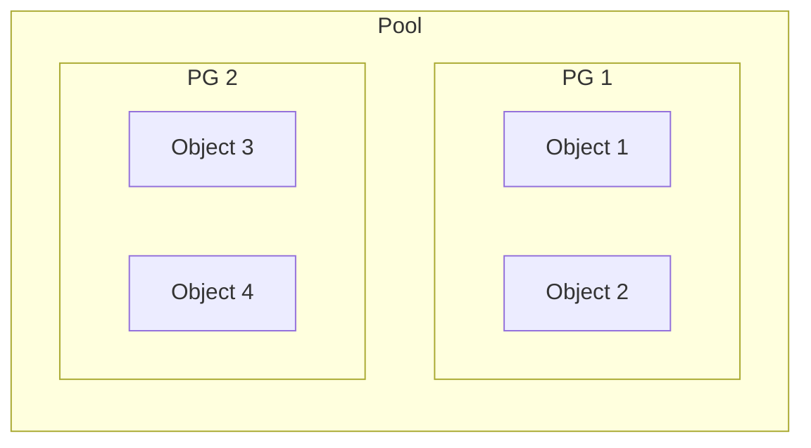
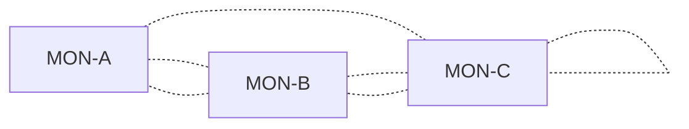
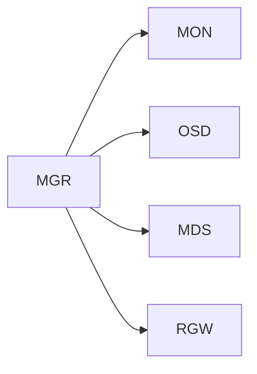
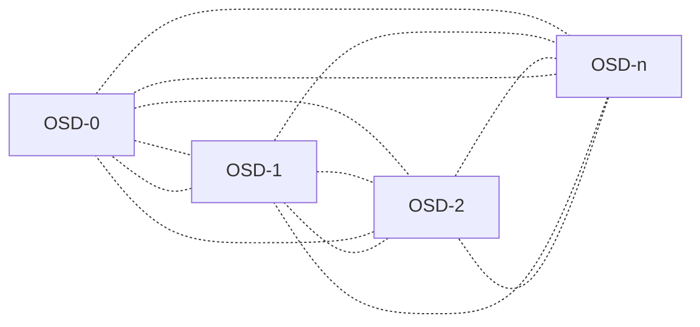
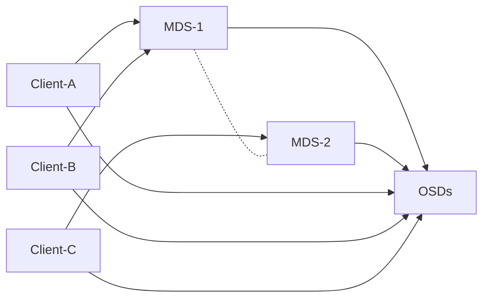
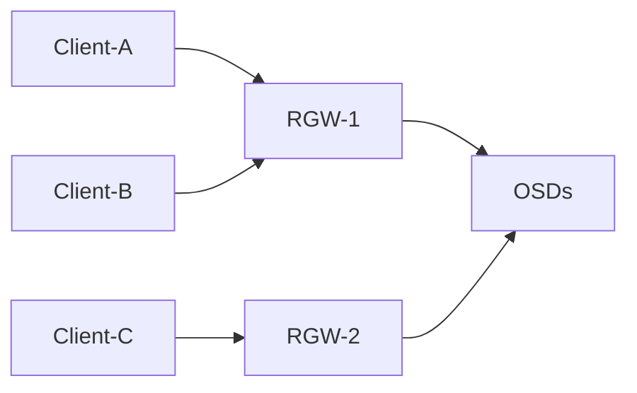
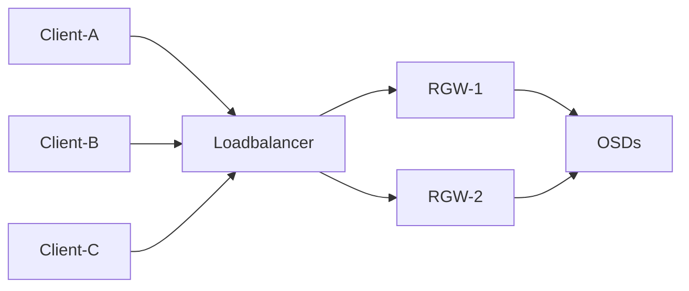

# Ceph

Ceph offers block storage (RBD), network filesystem (CephFS), object storage (RGW, S3, SWIFT) and key value storage (librados).

## Glossary

* Daemons
    * MON: Monitor Daemon
    * MGR: Manager Daemon
    * OSD: Object Storage Daemon
    * RGW: Rados Gateway
* "Things"
    * Pool: Group of PGs, separation .
    * PG: Placement Group, group of objects in a pool.
    * Object: A single object "somewhere in the cluster". Part of a PG.

### Pool -> PG -> Object

## Ceph Cluster Components

### MON - Monitor Daemon

The MONs are keeping a **map** of the current MONs, OSDs, PGs, Pools and so on.

MONs require a quorum to function, meaning that you should always run at least 3 mons for production 5 can be a good idea as well.

**Man Page**: https://docs.ceph.com/en/latest/man/8/ceph-mon/

#### Quorum

Simply put, if you run with 3 MONs you can lose 1 MON before the cluster will come to a halt as the quorum would be lost.

| MONs | How many can be lost? |
| ---- | --------------------- |
| 1    | 0                     |
| 2    | 0                     |
| 3    | 1                     |
| 4    | 1                     |
| 5    | 2                     |
| 6    | 2                     |
| 7    | 3                     |

For more information regarding quorum, checkout the following link from the ETCD documentation: [ETCD v3.3. - FAQ Why an odd number of cluster members?](https://etcd.io/docs/v3.3/faq/#why-an-odd-number-of-cluster-members).
ETCD is a good example of an infrastructure critical application (for Kubernetes) which requires a Quorum for (most; depending on your settings) operations.

### MGR - Manager Daemon

The MGR daemon(s) "provide additional monitoring and interfaces to external monitoring and management systems". You need to have at least one running as otherwise certain status information in, e.g., `ceph status` (`ceph -s`), will not be shown.
It is recommended to run at least 1.

The MGR daemon(s) talk with the MON, OSD MDS, and even RGW.

The MGR daemon(s) have many modules to for example provide metrics for Prometheus, Zabbix and others. In addition to that a Ceph dashboard can be activated which contains some basic information and even an integration with Prometheus and Grafana.

**Man Page**: https://docs.ceph.com/en/latest/mgr/index.html

### OSD - Object Storage Daemon

All OSDs normally talk with each other for hearbeat :heart: checking and data replication (actual data and also for data "scrubbing" operations).

* If a client writes data, the data is replicated by the OSD and not the client.
* If a client reads data, the data can be read from multiple OSDs at the same time (as long as they have a replica of the data).
* **Side note**: _That is the reason why read speeds are so fast and writes can be so slow. One slow OSD can "ruin your day" because of that._

**Man Page**: https://docs.ceph.com/en/latest/man/8/ceph-osd/

### MDS - Metadata Server Daemon

The MDS is the metadata server for the CephFilesystem (CephFS).

It talks with the OSDs and coordinates the filesystem access. Clients still need to access the OSDs, but the MDS is the "gateway" to know where to go so to say.

**Man Page**: https://docs.ceph.com/en/latest/man/8/ceph-mds/

### RGW - RADOS REST Gateway

RGW can offer S3 and / or SWIFT compatible storage, allowing to use it as a "replacement" for AWS S3 object storage in some cases.
An advantage to, e.g., the block storage (RBD) and CephFS is that the client itself does not need direct access to the MONs, OSDs, etc., though it depends on the use case and the performance required per client / application.

Common scenario is that you have a load balancer in front of your RGWs, in itself the structure stays the same:

**Man Page**: https://docs.ceph.com/en/latest/man/8/radosgw/

***

[This wonderful Ceph cheat sheet](https://github.com/TheJJ/ceph-cheatsheet) from [@TheJJ on GitHub](https://github.com/TheJJ) has much more insight into the processes, tricks and setup of a Ceph cluster and the moving parts.

***

## Old Diagrams

_The source for the diagrams, can be found as `.graphml` at the same path as the images._

### Basic Cluster with HDDs and SSDs

### Cluster with RGW for S3-compatible Object Storage

No direct OSD access network is required by the consumers of the object storage.
This can be seen as a "advantage" over RBD and CephFS, though it completely depends on your use case.

### Cluster with NVMe OSDs (+ Multi Datacenter Scenario)

